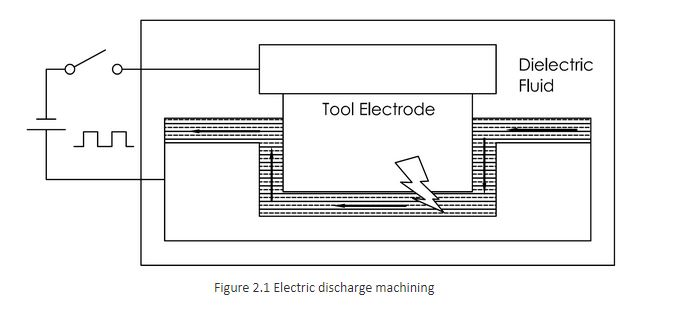
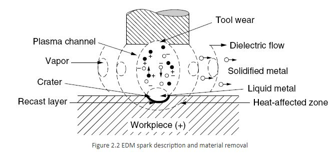
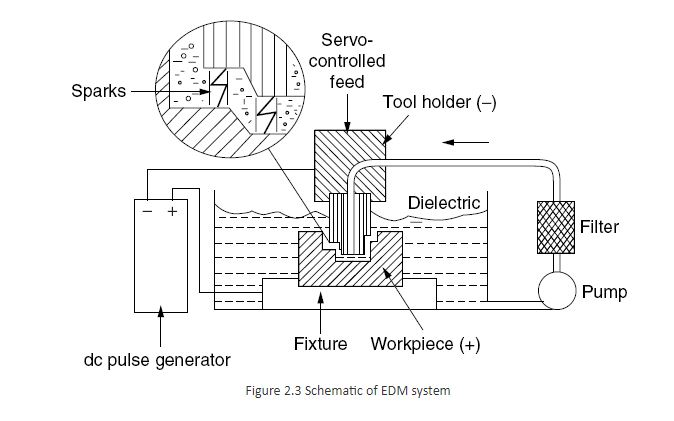
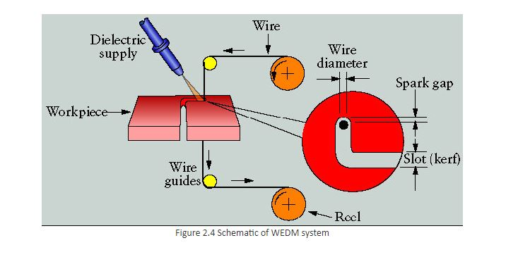

### Theory

### Prerequisite

For better understanding of the experiment a candidate should acquire following knowledge

1.   Modes of Heat transfer.
2.   Basic knowledge of Electrical Discharge Machining
3.   Various terminologies related to pulse.
4.   Understanding of various relevant terms viz. latent heat of melting, latent heat of vaporization, latent heat of evaporation.
5.   Some hands on experience for MATLAB programming.

**Erosion in EDM**

One of the most promising new methods of advanced manufacturing is electrical discharge machining, which uses the basic principle of spark erosion caused due to pulsed heating. Electrical discharge machining (EDM) is a non-traditional manufacturing process based on removing material from a part, by means of a series of repeated unipolar electrical discharges (created by electric pulse generators at short intervals) between a tool called electrode, and the part being machined, in the presence of a dielectric fluid. Thus, EDM uses the principle of spark erosion to machine the components. The dielectric fluid which is flushed in between the two electrodes also provides a medium for spark. At the present time, EDM is a widespread technique used in industry for high-precision machining of all types of electrically conductive materials such as: metals, metallic alloys, graphite, or even some conductive ceramic materials, irrespective of the hardness.

A simple block diagram as shown in the Figure 2.1 represents the basics of EDM. Material removal takes place as a result of the generation of extremely high temperatures due to the high-intensity discharges that melt and evaporate the electrodes (tool - electrode and job). Figure 2.1 shows a series of voltage pulses of magnitude about 20 to 120 V and frequency in the order of 5 kHz to 100 kHz is applied between the two electrodes, which are separated by a small gap, typically 0.01 to 0.5 mm. The material removal mechanism is considered to be prominently governed by three different erosion theories, which are as given below:

**i.High Pressure Theory (Siato)**
According to Siato, due to sudden stoppage of electro-dynamic waves, high impulsive pressure is generated which is responsible for the erosion of electrodes. In smaller energy discharges, the discharge pressure alone would not be sufficient to erode the material, but in conjunction with some other factors, such as heat, the pressure might blow out molten metal from the electrode surface.

**ii.Static Field Theory (Henry Williams)**
According to Coulomb's law, two charged electrodes experience an electrostatic force in between them. It may be stated in scalar form as, 'The magnitude of the electrostatic force between two point electric charges is directly proportional to the product of the magnitudes of each of the charges and inversely proportional to the square of the total distance between the two charges.

F = Ke q1 q2 / r2         (2.1)

In equation (2.1) where, r is the distance between the two charges and Ke is proportionality constant. A positive force implies a repulsive interaction, while a negative force implies an attractive interaction. Accordingly, the force between the electrodes produce stress on the electrodes which, when the gap is very small, may cross the ultimate stress limit of the electrode material resulting in a tensile rupture.

**iii.High Temperature Theory (Lazarenko)**
According to this theory, due to bombardment of electrons of high energy (kinetic) on the electrode surface, the spot attains high temperature (about 10,000&deg;C); especially with materials of low thermal conductivity. At this high temperature, the material at the spot instantaneously melts and vaporizes leaving a crater on the surface. The ratio between the energy expended at the anode and the total discharged energy are related to various parameters like gap between the electrodes, mean-free-path of electrons, anode and cathode work functions etc. This high temperature is not generated by electrons bombardment alone; the joule-heating by high density current is also considered to contribute. All the above theories do not individually define the spark machining phenomenon; however, these theories can be combined for the description of the process, the high temperature theory being the predominant one. A much improved combined theory is yet to be developed to contribute towards 100% stock removal in the process. While considering the thermal processing the electrons emitting from localized point in the cathode (by cold cathode emission) rapidly move towards anode under the influence of electric field causing an avalanche breakdown of the dielectric which allows a spark to break in, causing the plasma channel formation in between the sparking site as represented in the Figure 2.2. The intense current density within the plasma column creates the heat source to share the energy between work piece (major portion of the heat), tool (smallest part) and the rest to surrounding dielectric fluid. The heat given to anode melts and vaporizes the work site and similar phenomenon also might occur at cathode. The heat shared by dielectric pyrolyses and vaporizes it, covering the surrounding by a plasma channel. On withdrawal of the voltage pulse, plasma channel collapses (de ionization) and the infusion due to gauzing of the high pressure fluid into the plasma channel cools/ quenches metallic liquids and vapours to form debris. The evacuation of eroded particles by the fluid is called as flushing process and it continues with subsequent sparks forming minute craters on both the electrodes.

The intense current density within the plasma column creates the heat source to share the energy between work piece (major portion of the heat), tool (smallest part) and the rest to surrounding dielectric fluid. The heat given to anode melts and vaporizes the work site and similar phenomenon also might occur at cathode. The heat shared by dielectric pyrolyses and vaporizes it, covering the surrounding by a plasma channel. On withdrawal of the voltage pulse, plasma channel collapses (de ionization) and the infusion due to gauzing of the high pressure fluid into the plasma channel cools/ quenches metallic liquids and vapour's to form debris. The evacuation of eroded particles by the fluid is called as flushing process and it continues with subsequent sparks forming minute craters on both the electrodes. The main components of EDM system as represented in the Figure 2.3 are,

* Tool along with servo- controlled unit which maintains a constant machining gap that ensures occurrence of active discharges between the electrodes.
* Work holding device, submerged in a dielectric fluid (die sinking).
* Dielectric circulation unit which flushes the dielectric fluid to the inter-electrode gap along with filtration system.
* DC pulsed power supply that supplies pulses at a certain voltage, current, pulse on time and pulse off time.

	  
The phenomenon of erosion is same in WEDM process however; the tool electrode takes the form of a wire of (generally &Phi;100 to 300 &mu;m (micron)). The scheme of the process is as shown in Figure 2.4.

